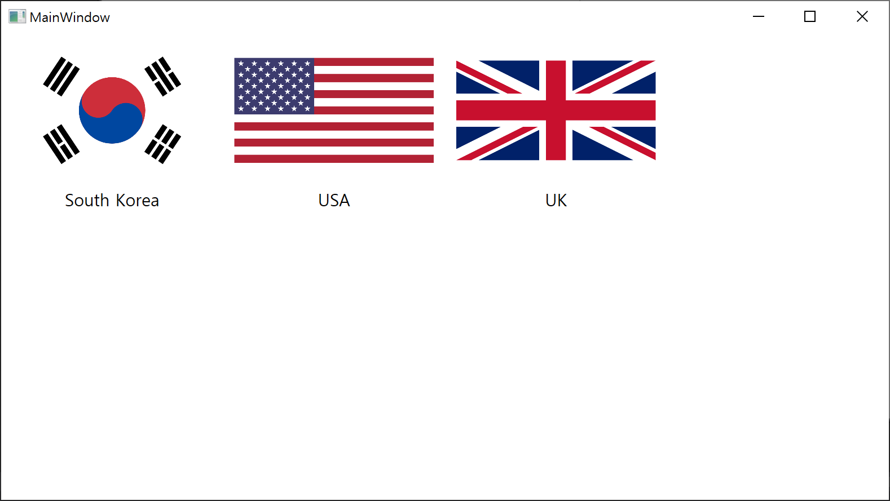

# Solution
> https://okky.kr/article/849972


## Result


## Button Style
```xaml
<Style TargetType="{x:Type Button}" x:Key="BTN">
    <Setter Property="Template">
        <Setter.Value>
            <ControlTemplate TargetType="{x:Type Button}">
                <Border BorderThickness="0" Margin="10">
                    <Grid>
                        <Grid.RowDefinitions>
                            <RowDefinition Height="*"/>
                            <RowDefinition Height="Auto"/>
                        </Grid.RowDefinitions>
                        <Image Grid.Row="0" Source="{Binding ImageUrl}"/>
                        <TextBlock Grid.Row="1" Text="{Binding Nation}" HorizontalAlignment="Center" Margin="10" FontSize="15"/>
                    </Grid>
                </Border>
            </ControlTemplate>
        </Setter.Value>
    </Setter>
</Style>
```

## Code
```csharp
Button btn1 = new Button();
btn1.Style = this.FindResource("BTN") as Style;
btn1.DataContext = new ButtonModel { Nation = "South Korea", ImageUrl = "Images/korea.png"};

Button btn2 = new Button();
btn2.Style = this.FindResource("BTN") as Style;
btn2.DataContext = new ButtonModel { Nation = "USA", ImageUrl = "Images/usa.png" };

Button btn3= new Button();
btn3.Style = this.FindResource("BTN") as Style;
btn3.DataContext = new ButtonModel { Nation = "UK", ImageUrl = "Images/uk.png" };

grid.Children.Add(btn1);
grid.Children.Add(btn2);
grid.Children.Add(btn3);
```
